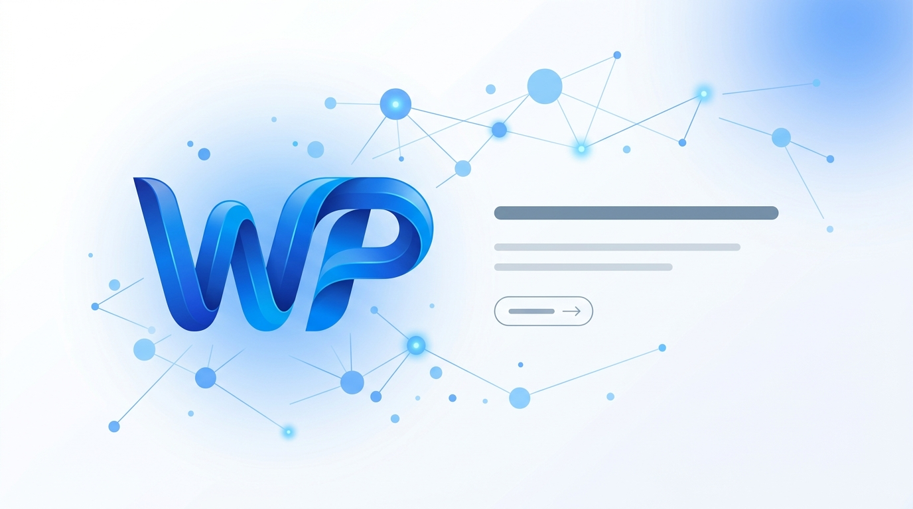
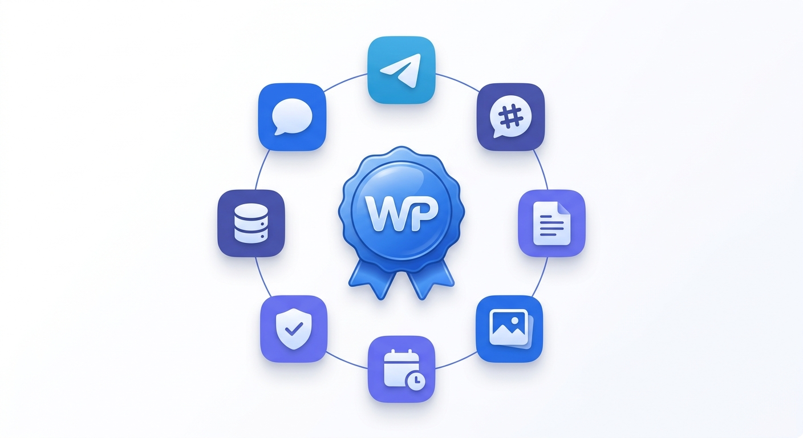
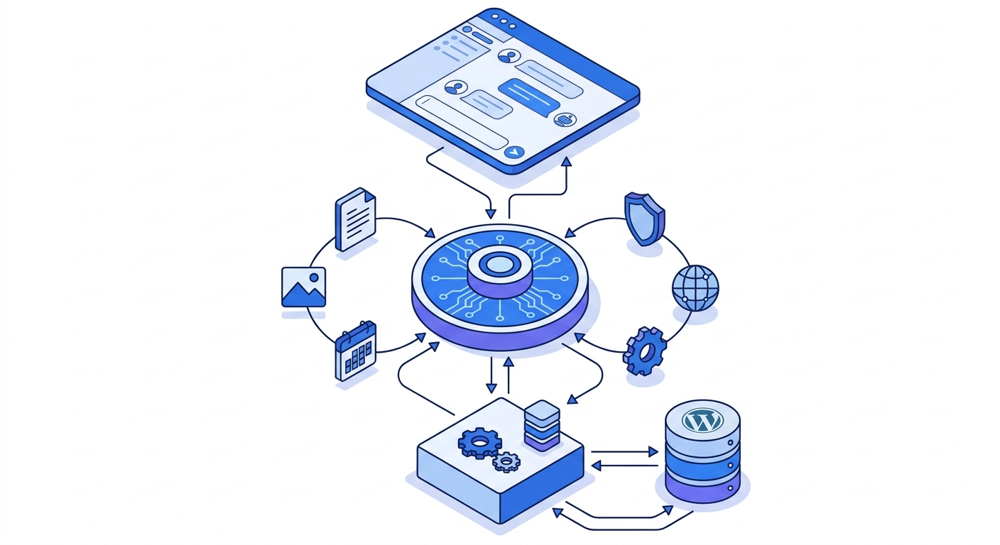
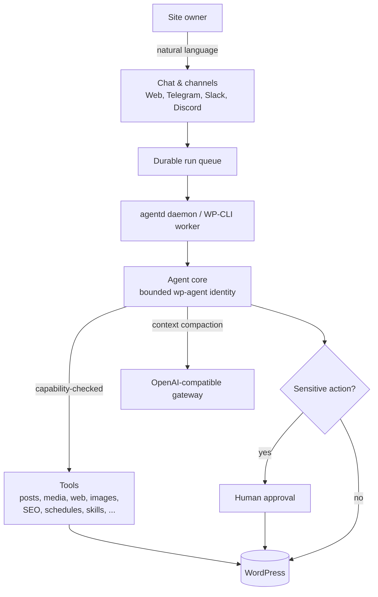

<!--
wporg:meta
contributors: GY19A
tags: ai, agent, chatbot, content, automation
requires_at_least: 6.0
tested_up_to: 6.9
requires_php: 8.0
stable_tag: 1.6.0
license: GPLv2 or later
license_uri: https://www.gnu.org/licenses/gpl-2.0.html
short_description: A natural-language WordPress agent for content, research, moderation, scheduling, and site management.
/wporg:meta
-->

<p align="center">
  
</p>

<h1 align="center">WP Agent</h1>

<p align="center">
  <strong>A natural-language AI agent that runs your WordPress site — research, write, illustrate, schedule, moderate, and publish, all from one chat.</strong>
</p>

<p align="center">
  
  
  
  
</p>

> **Copyright (C) 2026 GY19A &lt;info@wp-agent.org&gt;.** WP Agent is free, public-good software released under the GNU General Public License v2 or later. No Pro tiers, no license keys, no upsells.

<!-- wporg:description -->
## Overview

WP Agent turns WordPress administration into a natural-language workflow. From a dedicated full-page chat — or from Telegram, Slack, and Discord — describe a goal in plain language and let the agent research public sources, plan the work, draft long-form content, generate or import on-topic images, manage WordPress objects, schedule recurring tasks, request human approval, and publish or syndicate the result.

The agent runs under a dedicated, capability-bounded `wp-agent` WordPress identity. It can use any OpenAI-compatible AI gateway (cloud, self-hosted, or local), keeps secrets encrypted at rest, and pauses for human approval before sensitive or destructive actions.

## What It Can Do

- **Operator chat** — a full-page natural-language console with multimedia attachments (images, audio, video, PDFs, text, CSV, JSON) imported into the Media Library and passed to the agent as context.
- **Research & write** — web search and fetch (with SSRF protections), then original, sourced, long-form articles with SEO metadata.
- **Multimedia content** — generate images via the AI gateway, or import real, freely-usable images from the web, all placed in the body with alt text and captions and set as featured images.
- **Manage WordPress** — posts, pages, categories, tags, comments, media, menus, users, and SEO through native WordPress objects with preview links.
- **Autonomous runtime** — a native PHP daemon (`agentd`) and WP-CLI worker advance queued runs in the background, forking child agents for concurrency where `pcntl` is available, with a WP-Cron fallback.
- **Skills** — reusable, non-executable Markdown playbooks (research-article, paper-to-article, title-to-article, image-to-article, news-site operator, and more) installable from the GitHub Skill Store.
- **Scheduling** — minute-level and longer recurring tasks defined from structured fields or plain-language phrases.
- **Memory & journal** — durable preference/fact memory plus a work journal of goals, plans, actions, assets, decisions, failures, and handoffs.
- **Channels & integrations** — Telegram, Slack, Discord, WooCommerce, optional syndication targets, and user-configured MCP servers.

<p align="center">
  
</p>

### Core capabilities

* Full-page operator chat with multimedia attachment input.
* OpenAI-compatible AI gateway: use any HTTP or HTTPS OpenAI-compatible base URL, including self-hosted, local, or private network endpoints; defaults to `https://api.openai.com/v1`, with models loaded from `/models`. Chat and image generation can use separate configured model IDs, and the completion token cap and context window are configurable per install and per model.
* Posts and pages with native preview links.
* Web search and fetch with SSRF protections.
* Configurable private process-only sandbox workspace outside the web root for markdown, HTML, text, JSON, CSV, and XML artifacts.
* Image generation imported into the WordPress media library, plus real-image import from public sources.
* Chat attachments for images, audio, video, PDFs, text, CSV, and JSON files; uploads are imported into Media Library and passed to the agent as context.
* PHP WP-CLI worker for autonomous background execution, with WP-Cron fallback.
* Native PHP CLI worker entrypoint for supervisor, systemd, or container command use.
* Native PHP `agentd` host process that can be woken from WP-CLI or Dashboard and can fork child agents when `pcntl` is available.
* Non-executable Markdown skills for reusable agent workflows, including a built-in news-site operator template.
* Durable agent work journal for goals, plans, actions, generated assets, decisions, failures, and handoff notes.
* Category and tag management for editorial structure and keyword planning.
* Minute-level and longer recurring scheduled agent tasks from structured fields or common natural-language phrases.
* Automatic conversation compaction so long-running runs stay within the model's context window.
* Human moderation links and optional syndication to configured targets.
* Telegram, Slack, Discord, WooCommerce, and MCP support.

### Security

* The agent acts as a dedicated `wp-agent` user bounded by the selected operating mode.
* Root mode still cannot execute server code, edit plugin/theme files, install plugins, or use unfiltered HTML.
* Every tool checks WordPress capabilities.
* Sensitive/destructive actions pause the run for server-side human approval.
* Secrets are encrypted at rest and never echoed back.
* Isolated code execution is disabled by default and is available only when an explicitly enabled restricted backend passes runtime self-checks. The native PHP CLI backend uses an input snapshot, ephemeral output, open_basedir, disabled process/network functions, timeout, memory, and import quotas; QEMU/KVM microVM execution is not part of the plugin runtime path.
* Private runtime storage can be moved from the server temp directory to a persistent non-web path in WP Agent > Settings.
* Internal data (built-in skills, model pricing) ships as ABSPATH-guarded PHP, so it cannot be downloaded over HTTP on any web server.
* Webhook signatures and channel pairing protect external channels.
<!-- /wporg:description -->

## Architecture

WP Agent is a layered agent runtime inside WordPress: a chat/channel surface feeds a bounded agent core, which calls capability-checked tools, runs autonomously through a background daemon, and persists everything in dedicated database tables.

<p align="center">
  
</p>



<!-- wporg:section:Background Worker -->
## Autonomous Runtime

For production autonomy, wake the native PHP agent daemon:

```bash
wp wp-agent daemon wake --max-children=3
```

Or run it in the foreground:

```bash
php wp-content/plugins/wp-agent/bin/agentd.php --max-children=3
```

The daemon records a PID and heartbeat, watches queued runs, and forks child agent processes when `pcntl` is available. Each child claims a run atomically so different tasks can advance concurrently. Runtime control files live under the private runtime root, defaulting to a site-scoped temp path such as `/tmp/wp-agent/runtime/<site-scope>/`. The root can be moved to a persistent non-web path in WP Agent > Settings > Runtime Storage. If `pcntl` is unavailable, the daemon reports a single-process fallback.

The bounded worker remains available:

```bash
wp wp-agent worker --max-seconds=300 --sleep=2 --batch=1
```

Or use the native PHP entrypoint:

```bash
php wp-content/plugins/wp-agent/bin/worker.php --max-seconds=300 --sleep=2 --batch=1
```

The worker claims durable runs and advances them one checkpointed model/tool step at a time. WP-Cron provides a bounded fallback tick for shared hosting.
<!-- /wporg:section -->

<!-- wporg:section:External Services -->
## External Services

WP Agent connects to external services only when configured by the site owner.

**AI Gateway**
WP Agent sends AI chat, model discovery, and image generation requests to the configured OpenAI-compatible gateway. Use any HTTP or HTTPS OpenAI-compatible endpoint in WP Agent > Settings, including self-hosted, local, or private network gateways, or force one with `WP_AGENT_AI_BASE_URL` / `WP_AGENT_MEOWL_BASE_URL` in `wp-config.php` or the server environment. The default is `https://api.openai.com/v1`. The site owner must provide a valid API key for the configured gateway. If the gateway requires a separate image-capable model, set the Image Model field in Settings.

**Telegram Bot API**
When a Telegram bot token is configured, WP Agent receives and sends messages through Telegram's Bot API.

**Slack API**
When Slack credentials are configured, WP Agent communicates with the owner's Slack app.

**Discord API**
When Discord credentials are configured, WP Agent handles Discord interactions and slash commands.

**X, Reddit, and user-configured MCP servers**
These are used only when explicitly configured for syndication or extension tools. Data sent depends on the action requested and the service configured.
<!-- /wporg:section -->

<!-- wporg:section:Installation -->
## Installation

1. Upload the `wp-agent` folder to `/wp-content/plugins/`.
2. Activate the plugin through the Plugins menu.
3. Go to **WP Agent > Settings** and enter your AI gateway endpoint and API key.
4. Choose an operating mode for the dedicated `wp-agent` identity.
5. Open **WP Agent > Chat** and start using natural-language site management.
6. Optionally configure Telegram, Slack, Discord, syndication targets, or MCP servers.

### Official WordPress container check

The repository includes `docker-compose.official.yml` (in the repository parent) for acceptance testing with official WordPress images only. It does not build a custom WordPress image, install system packages, expose KVM, run privileged containers, or start an `agentd` sidecar by default.

```bash
docker compose -p wp-agent-official -f docker-compose.official.yml up -d
```

Then install WordPress, activate WP Agent, and run diagnostics with the `wpcli` profile.

### Minimum Requirements

* WordPress 6.0 or higher
* PHP 8.0 or higher
* OpenSSL PHP extension
* An API key for the configured OpenAI-compatible gateway
* HTTPS for production webhooks
<!-- /wporg:section -->

## Hardening behind nginx / Caddy

The plugin's `includes/` directory holds files that are loaded **server-side via the filesystem** and are never meant to be fetched over HTTP. The built-in Skill prompts and the model pricing table are shipped as **ABSPATH-guarded PHP files** (`includes/data/skills/<slug>/skill.php` and `includes/data/model-pricing.php`) precisely so they **cannot be downloaded over HTTP on any web server** — a direct request executes PHP and returns nothing. No raw `SKILL.md` or `.json` data files are shipped in the plugin.

A shipped `includes/.htaccess` additionally denies direct requests to the whole `includes/` directory on **Apache** as defense in depth. `.htaccess` is ignored by **nginx, Caddy, LiteSpeed, and other non-Apache servers**; the PHP-guard approach above already protects the data there, but you can add the rule below to also block direct access to the plugin's PHP class files.

**nginx** — add inside the relevant `server { }` block:

```nginx
location ~* /wp-content/plugins/wp-agent/includes/ {
    deny all;
    return 403;
}
```

**Caddy** — inside the site block:

```caddy
@wpAgentInternals path /wp-content/plugins/wp-agent/includes/*
respond @wpAgentInternals 403
```

Reload the server after adding the rule (`nginx -s reload` / `caddy reload`). The plugin's `assets/` directory (logo, CSS, JS) is intentionally public and must remain reachable — only `includes/` should be blocked.

<!-- wporg:faq -->
## Frequently Asked Questions

### Does WP Agent use OpenAI or third-party gateways directly?

Yes. WP Agent can use any HTTP or HTTPS OpenAI-compatible endpoint configured in Settings, including self-hosted, local, or private network gateways. It defaults to `https://api.openai.com/v1` if no custom provider is configured.

### Can the agent execute code on my WordPress server?

The public WordPress control plane never receives plugin/theme/core code editing capabilities, including in root mode. Optional PHP snippet execution remains fail-closed unless a site owner explicitly enables a restricted backend that passes self-checks.

### Can the agent remember what it did?

Yes. WP Agent has preference/fact memory and a durable work journal for operational history such as goals, plans, actions, assets, schedules, failures, and handoffs.

### Can it generate images?

Yes. The `generate_image` tool uses the configured OpenAI-compatible gateway and imports the result into the WordPress media library. It can also import real, freely-usable images from public sources. If your gateway routes image models separately, configure an image-capable model ID in Settings.

### Are the plugin's internal files (skills, pricing data) protected from public download?

Yes. The built-in Skill prompts and the model pricing table are shipped as ABSPATH-guarded PHP files (includes/data/skills/<slug>/skill.php and includes/data/model-pricing.php), so a direct HTTP request executes PHP and returns nothing on any web server (Apache, nginx, Caddy, ...). No raw SKILL.md or .json data files are shipped. A shipped includes/.htaccess additionally blocks the includes/ directory on Apache as defense in depth; the "Hardening behind nginx / Caddy" section shows an optional equivalent rule for non-Apache servers. The assets/ directory (logo, CSS, JS) is intentionally public.
<!-- /wporg:faq -->

## Development

- Plugin code lives in this repository; `docker-compose.yml` (repository parent) runs the local dev stack with a privileged sandbox, and `docker-compose.official.yml` runs the clean official-image acceptance stack.
- Run PHP lint across changed files: `find . -name '*.php' -print0 | xargs -0 -n1 php -l`.
- Reusable Skill prompts are authored in the public Skill Store repository as `SKILL.md`; regenerate the guarded built-in wrappers with `php bin/build-skill-php.php <path-to-store-skills>`.
- Regenerate `readme.txt` from this file with `php bin/build-readme-txt.php`.

<!-- wporg:changelog -->
## Changelog

### 1.6.0
* Made the completion token cap (`max_tokens`) configurable per install and per model, and added automatic conversation compaction so long runs stay within the model context window.
* Enforced long-form, image-rich articles (length and multiple on-topic images) in the content-quality gate and article skills.
* Shipped built-in skills and model pricing as ABSPATH-guarded PHP and added nginx/Caddy hardening guidance so internal data cannot be downloaded over HTTP on any server.
* Added a GitHub Skill Store with search and one-step install, plus a skill-creator skill.
* Refreshed branding (new logo) and assorted admin UI polish.

### 1.5.4
* Removed the in-plugin microVM runner and QEMU/KVM backend path. Code execution remains fail-closed by default and can only use native restricted PHP CLI or namespace backends when explicitly available and enabled.
* Kept `execute_code` runs behind server-side human approval even when an explicitly enabled restricted backend is available.

### 1.5.3
* Kept code execution fail-closed unless a supported hardened backend passes runtime checks.
* Improved runtime backend reporting so unavailable isolation backends remain explicit in diagnostics.

### 1.5.2
* Fixed isolated PHP execution checks under web requests by resolving a verified PHP CLI binary before entering the `bwrap` sandbox.

### 1.5.1
* Added minute-level scheduled agent tasks with configurable per-schedule minute cadence.
* Changed the schedule checker to a one-minute cron cadence so minute-level tasks can be claimed promptly.

### 1.5.0
* Added `bin/agentd.php`, a native PHP host process for the agent runtime.
* Added `wp wp-agent daemon status|wake|stop|run` and Dashboard wake/stop controls.
* Added process-level sub-agents: when PHP CLI has `pcntl`, the daemon forks child agents to process different queued runs in parallel.
* Added daemon PID, heartbeat, child count, fork capability, and log-path status to Dashboard and the `runtime` tool.
* Extended isolated execution so snippets can write allowed artifacts to `/workspace/output`, then the broker imports them through sandbox allowlists and quotas.

### 1.4.0
* Added `bin/worker.php`, a native PHP CLI worker entrypoint that runs the same durable queue loop as WP-CLI.
* Added the isolated sandbox execution contract and a PHP-only `execute_code` tool that is exposed only when a hardened backend is usable.
* Added a `bwrap` namespace backend with network isolation, cleared environment, read-only system/workspace mounts, timeout, memory, and output limits.
* Restricted `execute_code` to `manage_options`, required human confirmation for code runs, and kept persistent writes behind normal WordPress tools.
* Kept execution fail-closed: if no hardened backend passes self-checks, code execution is unavailable and no raw process fallback is used.

### 1.3.0
* Added server-side human confirmations for sensitive tool calls. Confirmation tokens are no longer exposed to the model.
* Confirmation params and results are encrypted at rest and guarded by atomic one-time state transitions.
* Added run event timelines for queued, claimed, paused, completed, errored, approved, and rejected work.
* Added a Skills admin page for creating and archiving reusable non-executable Markdown playbooks.
* Added hard monthly budget enforcement before billable model steps.
* Improved chat polling so approval cards survive refresh through active-run recovery.

### 1.2.0
* Added PHP WP-CLI autonomous worker and one-minute WP-Cron fallback.
* Queued scheduled and channel work as durable runs instead of long synchronous requests.
* Added non-executable Markdown skills and the `manage_skills` tool.
* Split actor/requester context so the bounded `wp-agent` user executes tools while user-owned memory, skills, approvals, and journals stay scoped to the requester.
* Added dashboard runtime status and fixed stale setup/audit UI issues.

### 1.0.1
* Added durable agent work journal.
* Added image generation tool.
* Removed obsolete sidebar chat resources and license activation code.
* Updated public documentation for the OpenAI-compatible gateway architecture.
* Replaced the application icon.

### 1.0.0
* Initial WP Agent release.
<!-- /wporg:changelog -->

<!-- wporg:upgrade_notice -->
## Upgrade Notice

### 1.6.0
Adds configurable model token limits with automatic context compaction, long-form image-rich content enforcement, and hardened internal data that cannot be downloaded over HTTP on any web server.

### 1.5.4
Code execution remains fail-closed by default and requires a human approval card before any `execute_code` run is executed.
<!-- /wporg:upgrade_notice -->

## License

WP Agent is free software: you can redistribute it and/or modify it under the terms of the **GNU General Public License v2 or later** as published by the Free Software Foundation. See [LICENSE.txt](LICENSE.txt) for the full text.

Copyright (C) 2026 GY19A &lt;info@wp-agent.org&gt;.

This program is distributed in the hope that it will be useful, but **WITHOUT ANY WARRANTY**; without even the implied warranty of MERCHANTABILITY or FITNESS FOR A PARTICULAR PURPOSE.
